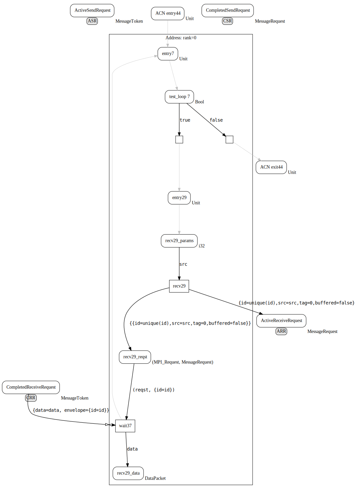
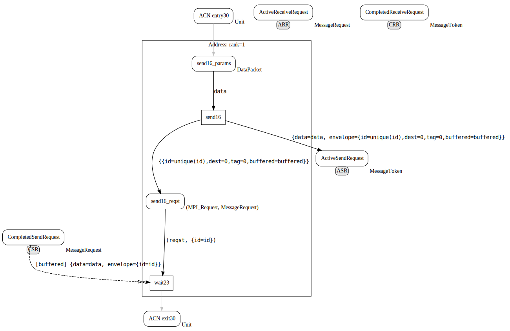

# Morpheus


Morpheus is an open-source tool for extracting an abstract model of communication from a code MPI (Message Passing Interface) applications. Generated abstract model of communication is called _MP net_ and it is strongly inspired by [Coloured Petri nets](https://en.wikipedia.org/wiki/Coloured_Petri_net). MP net is aims to help people better understand the communication aspect of MPI program. The assumption is, that the structure of communication which has inherently spatial character can be better understood by looking at a kind of graph than by reading the code.

More information about MP nets can be found in [MP net as Abstract Model of Communication for Message-passing Applications](https://arxiv.org/abs/1903.08252).

## Installation

To make the installation as easy as possible there is a prepared [Dockefile](https://docs.docker.com/engine/reference/builder/) to build a docker container with all necessary stuff.

### Prerequisites

* [Docker](https://docs.docker.com/) install Docker according to the [instructions](https://docs.docker.com/install/linux/docker-ce/ubuntu/#install-using-the-repository).
* [xdot](https://github.com/jrfonseca/xdot.py) `$ sudo apt-get install xdot`


### Install Morpheus

Build docker container
```
$ ./build-docker-container.sh
```
<!-- $ sudo addgroup docker -->
<!-- $ sudo usermod -aG docker $USER -->

Morpheus can be installed to the hosting system directly as well. To do so, you can follow the instructions contained in [Dockerfile](Dockerfile).

## Run Morpheus

To run Morpheus within the built docker image, there is a script `docker-morpheus-run.py` that overlays the fact that Morpheus is run within the container. The first argument is the path to an analyzed file, the one with MPI code. The second argument (`-np`) determines the number of processes. Similarly to `mpirun` the analysis is done for a specific number of processes. The last argument (`-o`) specifies the directory for output files.

```
$ ./docker-morpheus-run.py path/to/mpi_src_code.cpp -np <NUM_OF_PROCS> -o path/to/output_dir
```

In case of direct installation Morpheus can be run directly (`src/morpheus.py`) with the same interface.

## Example
 To test everything works fine, you can run Morpheus on a testing example, located at `examples/all-send-one/aso-v1.cpp`.
 
```
$ ./docker-morpheus-run.py examples/all-send-one/aso-v1.cpp -np 2
```
 
It will generates to files `aso-v1-rank_0.cpp` and `aso-v1-rank_1.cpp` at the current working directory. Each of the file contains MP net for particular processes (zeroth and first). You should see the MP nets that looks as follows:

### MP net for `aso-v1.cpp`:

#### Input code
```c++ 
#include "mpi.h"

int main (int argc, char *argv[]) {
  enum { TAG_A };

  MPI_Init(&argc, &argv);

  int rank, size;
  MPI_Comm_rank(MPI_COMM_WORLD, &rank);
  MPI_Comm_size(MPI_COMM_WORLD, &size);

  if (rank == 0) {
    int ns[size-1];
    for (int i=0, src=1; src < size; i++, src++) {
      MPI_Recv(&ns[i], 1, MPI_INT, src, TAG_A, MPI_COMM_WORLD, MPI_STATUS_IGNORE);
    }
  }else {
    MPI_Send(&rank, 1, MPI_INT, 0, TAG_A, MPI_COMM_WORLD);
  }

  MPI_Finalize();
  return 0;
}
```

#### Generated MP net
* addressable area for the rank zero:


* addressable area for the rank one:



## Limitations and known issues

* MPI communication is within single function.
* ``Recycled'' `MPI_Request` variables. When a request variable is used more than once it cause the crash of analysis. The matching process does not work correctly.
* object with non-trivial destructor complicates the CFG structure and introduce more edges skipping to the exit place.
